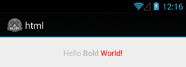

# XP.UI
CommonJS module providing cross-platform UI elements for Titanium Alloy. By adding `module="xp.ui"` to any tag in an Alloy view, this module will become the factory instead of `Ti.UI`, allowing it do provide emulate views and behavior when it is not available for the target platform.

* [example](../app/controllers/xp.ui.js) (some)
* [source](../app/lib/xp.ui.js)

### Available tags

* `NavigationWindow`

    Emulates the `Ti.UI.iOS.NavigationWindow` for Android.
* `Window`

    Returns a `Ti.UI.Window` on iOS and `Ti.UI.View` on others.
* `TextArea`

    Emulates Android's `hintText` property for iOS.
* `Label`

    Emulates Android's `html` property for iOS using [ti-html2as](http://github.com/fokkezb/ti-html2as)
* `TextField`

    Disabled Android's autofocus on the first TextField.

Read the original blog at: [http://fokkezb.nl/2013/10/21/cross-platform-ui/](http://fokkezb.nl/2013/10/21/cross-platform-ui/)

## Why?
[Alloy](http://projects.appcelerator.com/alloy/docs/Alloy-bootstrap/index.html) does a great job at supporting single-codebase cross platform apps by providing conditional tags and constants, but you still have to actually use these to code around the platform differences.

## How to use it

1. Download [xp.ui.js](https://github.com/FokkeZB/UTiL/blob/master/xp.ui/xp.ui.js) to `app/lib/xp.ui.js`.
3. Add `module="xp.ui"` to the element you want to use this library instead of `Ti.UI` to create the view.

## Tag: Label

For iOS, and only if you pass a `html` property, it will parse the HTML to an Attributed String using te [nl.fokkezb.html2as](http://github.com/fokkezb/ti-html2as) module which you need to have installed as well.

Since the `nl.fokkezb.html2as` module is async, the label will first return empty and the attributed string will be set as soon as the HTML is parsed. You will only notice this on slow devices with large HTML.

### Example

```
<Alloy>
  <Window>
    <Label module="xp.ui" html="<font size=17>Hello <b>Bold</b> <font color=#FF0000>World!</font></font>" />
  </Window>
</Alloy>
```




## Tag: TextArea

For some reason, on iOS a TextArea doesn't have a `hintText` property. This module adds event listeners for focus and blur to change the color and value to emulate the same behavior as a TextField has.

## Tag: Window

For some modules, like NappDrawer, you need to have a Window on iOS and a View on Android. The module does exactly this.

## Tag: NavigationWindow

For Android, it creates and returns an intermediate object that exposes `Ti.UI.iOS.NavigationWindow`-like `openWindow` and `closeWindow` methods. Two more `open` and `close` methods will act on the root window wrapped by the `NavigationWindow` tags, giving exact the same behavior as on iOS.

### Example code

```
<Alloy>
  <NavigationWindow module="xp.ui">
    <Window>
      <Label>Hello World</Label>
    </Window>
  </NavigationWindow>
</Alloy>
```

### Swipe to go back
Unless you set the `NavigationWindow`'s `swipeBack` attribute to `false` or pass this as an option to `openWindow`, the module will add a swipe-eventlistener to close the window when the user swipes to the right, just like it does on iOS7. For Android, it adds `slide_in_left` and `slide_out_right` enter/exit animations unless you pass `animated: false` as an option for `openWindow`.

### Action Bar
If you target Android SDK 11 or higher the module will automatically add the [up arrow](http://developer.android.com/training/implementing-navigation/ancestral.html) to the action bar of all but the first window. Clicking on the home icon or arrow will close the window. You can disable this by setting the `NavigationWindow`'s `displayHomeAsUp` attribute to `false` or passing this as an option to `openWindow`.

## Tag: TextField
On Android, this will blur the textfield to prevent auto focus.